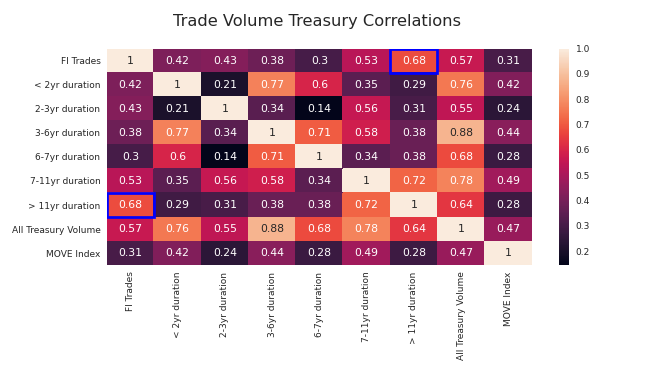
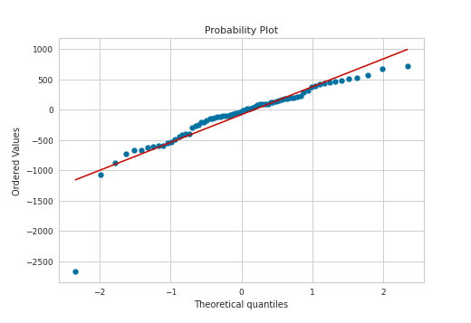
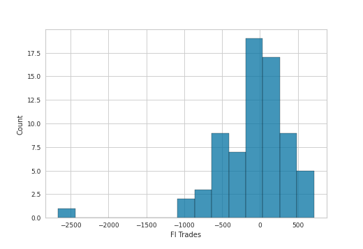
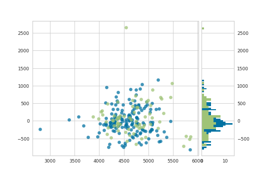

## Fixed_Income_Trading_Regression

<!-- wp:paragraph -->

Regressing client trading activity to the treasury markets and bond market volatility.

<!-- /wp:paragraph -->

<!-- wp:paragraph -->

The following project is an example of an analysis that I performed for work on behalf of a request from the CFO of my organization.   I was tasked with running a regression analysis on the average trading volumes for US Treasuries and understand the correlations with internal fixed income trading revenues.  We also looked at the MOVE Index (Merrill Lynch Option Volatility Estimate) to analyze that correlation as well.

<!-- /wp:paragraph -->

<!-- wp:paragraph -->

A significant portion of the revenues in this business unit gets generated from the processing of client trading activity. in US treasury securities. Suffice to say, the ability to forecast revenues is integral to management's guidance to Wall Street and thus it's performance and limiting earnings volatility.  

<!-- /wp:paragraph -->

<!-- wp:paragraph -->

I will begin by highlighting some of the data consolidation and preprocessing skills utilized in this project as well as some visualization techniques brought to bear.  

<!-- /wp:paragraph -->

### Overview

* Analyze the datasets from internal trading activity, MOVE treasury volatiilty index, and Primary Dealer activity
* Find feature variables that could help predict future client trading activity
* Find weakness in the premise that the MOVE volatility index could predict internal trading volumes

### Code and Resources Used
Python Version: 3.7  
Environment: Jupyter notebook 
Packages: pandas, numpy, statsmodels, sklearn, matplotlib, seaborn, scipy, yellowbrick
*The datasets for this project have been sourced both internally and anonymized as well as from NY Fed data on Primary Dealer activity published weekly and the treasury volaiilty proxy, MOVE Index (Merrill Lynch Option Volatility Estimate ‒ a well-recognized indicator of U.S. interest rate volatility that is often referred to as the VIX for Bonds.

### Data Cleaning
After reading in the data, it was necessary to transform the data to prepare it for modeling it in the formats of internal dataset
* The Primary Dealer activity is published weekly and therefore all datasets were transformed from daily to weekly to conform with the less frequent dataset rather than interpolating data into a misrepresented set.
* Some of the datasets contained NaN values and those values were interpolated by taking the average between nearest values of the NaN

### EDA
I looked at a correlation matrix to determine which predictor variables were ultimately sufficient for modeling (high correlation to the target) as well as careful to introduce multicollinearity which was a potential issue in this set. Below are a few highlights:

Given the correlations of nearly 70%, I chose the > 11yr maturity series as well as the All Treasury Volume aggregation of all maturities in the primary dealer dataset.  

From the Q-Q plot we see more easily how the residuals deviate from the tails of the distribution, therefire, they are not normally distributed.

### Model Building
Given the correlations, we'll focus on the longest duration,and total volume.  I was concerned about the multicollinearity, however the predictors did not display a very strong correlation(0.6) and the tradeoff is that we can incorporate the shorter-term durations in addition to the longer dated maturities.

We see that the residuals show a fairly normal distribution centered at 0. Not perfect, by visual inspection there is some skew towards the right, with a few higher unusual values towards the left of the distribution.

* The mean square error was fairly high as seen below and therefore I went back to further transforming the variables with the box-cox transformation

**Train set**
Linear Regression mse: 25373394232.99647

**Test set**
Linear Regression mse: 40162556060.600044

### Model Performance

On the right, we have the distribution of the residuals in the train and test sets. We see that it is not perfectly centered at 0.  On the left, we have the residuals vs the predicted value, we also see that the variance is not constant. Towards the extremes of the predictions, the model is under-estimating the outcome (most residuals are negative). And towards the center of the predictions, the model is over-estimating the outcome. So the residuals variance is not constant for all values.

In this case we didn't witness much of an improvement afte the transformations. We need to keep digging for other predictor variables to build a stronger model. But we've been able to rule out some factors that may have made some intuative sense yet failed to significantly explain the behavior of the internal trading volumes
